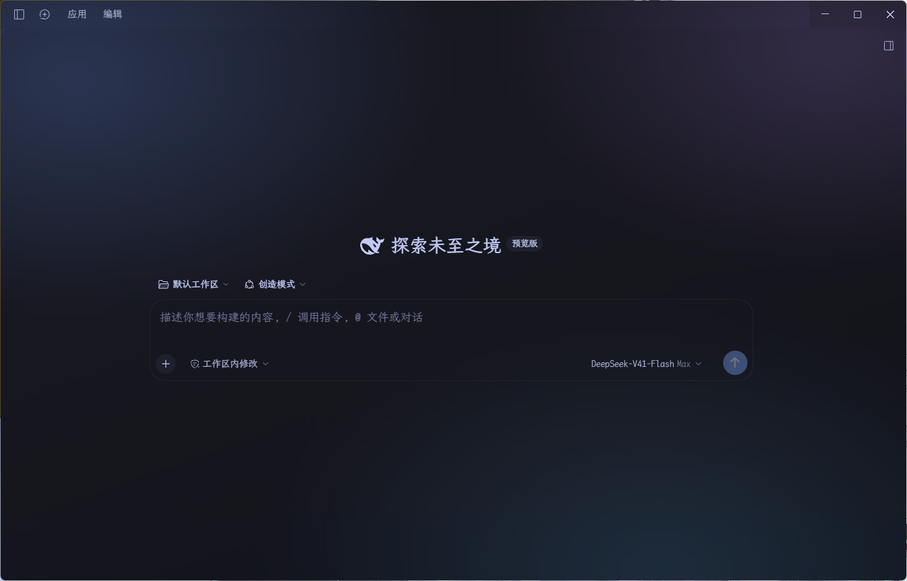
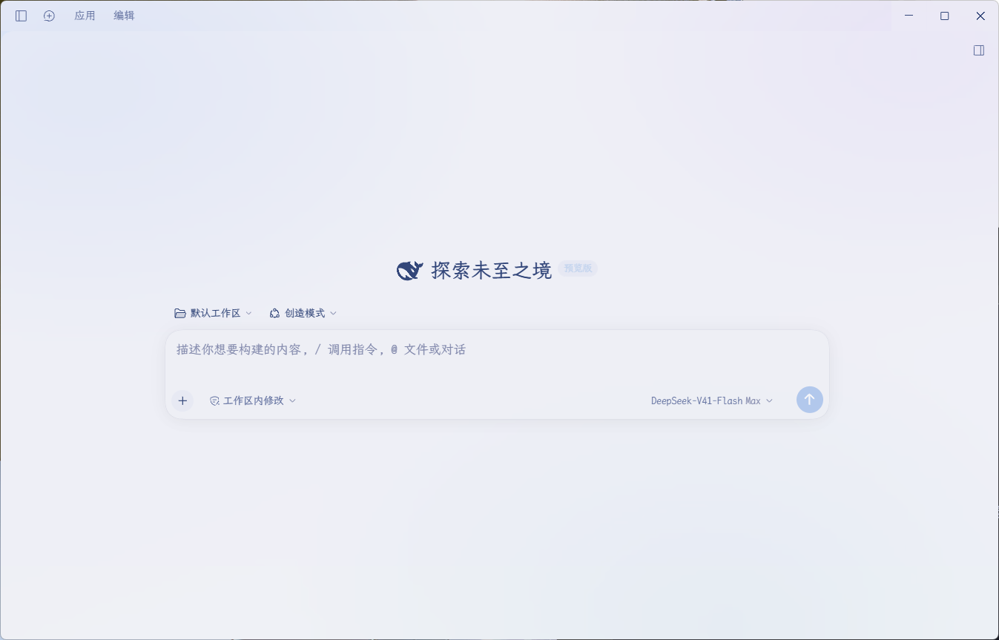
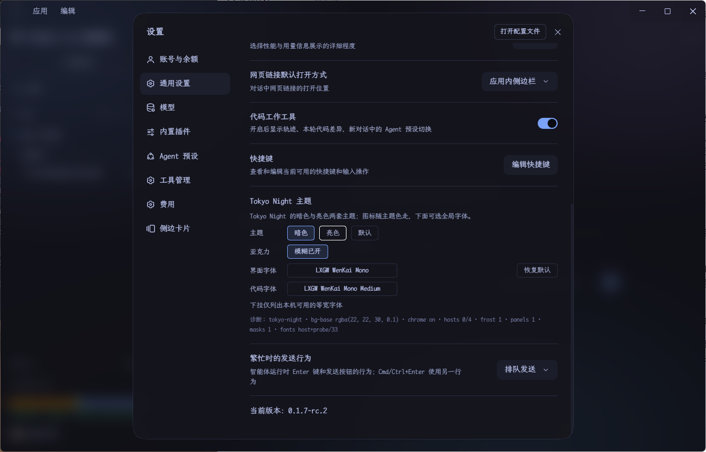

# dsh-desktop-acrylic

**中文** · [English](README.en.md)

Tokyo Night themes for [DeepSeek Harness](https://github.com/deepseek-ai/deepseek-harness) (DSH) Desktop —
两套主题（暗色 / 亮色）、磨砂面板、等宽字体选择。

两套皮肤都是**注册进内置主题运行时的真实主题**（`ctx.theme.register`），因此切换主题就是切换
运行时偏好本身，不依赖属性开关或事后 CSS 覆盖。

> **DSH Desktop 测试版下载**：[deepseek-harness 讨论区](https://github.com/deepseek-ai/deepseek-harness/discussions/7667?sort=new#discussioncomment-18598677)。

> 若你在论文、报告或其它项目中使用本项目，请引用它 —— 引用模板见[引用与许可](#引用与许可)，
> 仓库根目录也提供了机器可读的 [`CITATION.cff`](CITATION.cff)（GitHub 会据此显示 "Cite this repository"）。

## 效果预览

**暗色** —— 欢迎页：



**亮色** —— 欢迎页：



**设置窗口** —— 磨砂面板与背景遮罩模糊（暗色；可见「Tokyo Night 主题」设置行与 `masks 1` 诊断）：



---

## 能力一览

| 能力                          | 实现方式                                                                                                                        | 参数                                                             |
| ----------------------------- | ------------------------------------------------------------------------------------------------------------------------------- | ---------------------------------------------------------------- |
| 主题：Tokyo Night 暗色 / 亮色 | 皮肤 token（静态色阶 + 别名色阶 + 组件专属 + 语法高亮），两套各 180 个 token                                                    | 暗色底`#1a1b26`；亮色底偏白（`#e7e8ee` → `#eff1f6` 一族） |
| 图标随主题变色                | 桌面端用`currentColor` 绘制图标且没有图标专属 token，因此图标自动跟随 `--dsw-alias-label-*` / `--dsw-alias-brand-primary` | 无需额外配置                                                     |
| 画布透明度                    | 背景族 token 带 alpha                                                                                                           | 暗色`0.10`（90% 透明）；亮色 `0.30`                          |
| 材质底层                      | 用主题自身的蓝/紫/青做的柔和色场，固定在最底层并预模糊                                                                          | 强度 暗 30% / 亮 24%，`blur(28px)`                             |
| 弹出菜单 / 下拉 / 浮层        | 皮肤下发`--dsw-menu-backdrop-filter`，由桌面端自带材质通路渲染                                                                | `blur(24px) saturate(1.15)`                                    |
| 对话框（设置窗口等）          | 磨砂面板：定位元素走 `isolation` + 绝对定位 `::before`；**静态元素**（设置窗口常见）改把模糊直接加在元素上，但先排除含 `position: fixed` 后代的对话框 | 底色`rgba(…, 0.75)`（25% 透明）+ `blur(30px)`               |
| 对话框背景遮罩                | 弹窗背后压暗页面的遮罩挂 `backdrop-filter`，透出磨砂主界面；原生 `<dialog>` 走 `::backdrop`；`prefers-reduced-transparency` 时随模糊层一并停用 | `blur(12px) saturate(1.1)`（`--dwa-mask-blur`）             |
| 工作区主侧栏                  | 均匀颗粒纹理（纯`background-image`，无方向性、无边缘）                                                                        | 暗色 6% / 亮色 14%（明暗感知不对称，故分开设值）                 |
| 卡片与表格（genui）           | 把卡片库自带的`--tv-*` 调色板桥接到我们的别名 token                                                                           | 22 条桥接，覆盖表面 / 交互 / 文字 / 图标 / 边框                  |
| 原生控件                      | `color-scheme` 随主题切换                                                                                                     | 滚动条、复选框等原生部件一并跟随                                 |
| 字体                          | 两个可搜索下拉（界面字体 / 代码字体），列出**本机可用的等宽字体**（含 NF / PL 变体）                                      | 见下文「字体探测」                                               |

集中定义：`src/theme.mjs` 的 `ACRYLIC`（模糊半径等）、`surfaceTable`（表面与 alpha）、
`MONO_FONTS` / `MONO_FONT_BASES` / `MONO_FONT_SUFFIXES`（字体数据）；样式规则由构建脚本生成。

---

## 安装

```sh
# 从 GitHub
dsh plugin --profile desktop add github:LeoLee0097/dsh-desktop-acrylic

# 从本地目录（-w 必需，profile 目录本身是 pnpm workspace 根）
dsh plugin --profile desktop add -w /absolute/path/to/dsh-desktop-acrylic
```

安装后**完全退出并重启** DSH Desktop。此后单独重载渲染进程也会重新拉取客户端包。

### 网页端（web profile）

> **声明**：开发者主要在 DSH Desktop 内测版中使用本插件，**未在网页端进行过测试**。如遇异常，
> 请把设置行诊断信息（`preference` / `matched` / `masks` 等）一并反馈。

同一插件可直接装到 web profile——桌面端本来就跑在 `@deepseek-ai/dsh-web-app` 上，浏览器半边
按 `platform: "web"` 声明，安装命令只是把 profile 换掉：

```sh
dsh plugin --profile web add github:LeoLee0097/dsh-desktop-acrylic
# 或本地目录
dsh plugin --profile web add -w /absolute/path/to/dsh-desktop-acrylic
```

网页端与桌面端的差异（客户端已自动降级，无需配置）：

- **持久状态**：宿主路由不可用时回退 `localStorage`——网页端 origin 固定，这层反而比桌面端更稳；
- **字体列表**：宿主目录扫描不可用，只剩渲染进程探测（候选目录见下文「字体探测」）；
- **视觉效果一致**：材质底层、磨砂面板、遮罩模糊全部在页面内完成，本来就不依赖窗口材质；
  若 web 构建的 DOM 类名不同导致候选选择器失配，诊断行的 `matched` / `masks` 会如实显示 0。

安装后**完全退出并重启** DSH Desktop。此后单独重载渲染进程也会重新拉取客户端包。

> 注意：**宿主半边（`lib/index.js`）的改动只有重启进程才会生效**，因为它的路由表在进程启动时
> 注册。客户端半边（`lib/client.js`）与数据表只需重载渲染进程。这一区别曾经导致过
> 「明明改了却 404」的误判，故明确写在这里。

## 使用

**设置 → 通用 → 「Tokyo Night 主题」**：

- **主题**：暗色 / 亮色 / 默认 —— 点击即时切换；
- **亚克力**：模糊已开 / 模糊已关 —— 关掉只去模糊、保留主题；
- **界面字体 / 代码字体**：同一个可搜索下拉，选中即生效，可「恢复默认」；
- **诊断行**：`当前偏好 · bg-base 计算值 · chrome on/off · hosts 已挂载/候选 · frost n · panels n`。

`bg-base` 取自 `getComputedStyle(document.body)`，是浏览器实际解析出的值——用来确认主题真的
落到了级联上，而不是「看起来没变化」。

### 字体探测

浏览器**不允许**枚举系统已安装字体，因此字体列表由两条路合并而成：

1. **渲染进程探测**（总是可用）：候选名字来自 `MONO_FONT_BASES` × `MONO_FONT_SUFFIXES`
   （42 基名 × 6 后缀 = 252 个探测名，后缀含 `NF` / `NFM` / `Nerd Font` / `Nerd Font Mono` / `PL`）。
   用 canvas 测量候选字体与三个 fallback 下的同一段文本宽度，任一不同即判定存在。
2. **宿主目录扫描**（路由可用时）：读取系统字体目录，解析字体文件的 `name` 表（族名）与
   `post` 表的 `isFixedPitch`（格式自带的等宽标志），因此能发现候选表之外的族（含 CJK 等宽）。

两者取并集。诊断字段 `fontSource` 会如实报告 `probe` / `host` / `host+probe`，`fontCount` 是条目数。

```sh
node scripts/check-fonts.mjs          # 打印宿主扫描结果（等宽清单）
node scripts/check-fonts.mjs --all    # 另外打印全部族名
```

## 项目结构

```
dsh-desktop-acrylic/
├── src/
│   ├── theme.mjs          # 调色板、两套皮肤、面板/纹理/字体/桥接 CSS（手写，规范来源）
│   └── client.tpl.js      # 浏览器半边模板（手写）
├── scripts/
│   ├── build.mjs          # 构建 + 自检 → 产出下面两项
│   └── check-fonts.mjs    # 本机字体扫描的调试工具
├── lib/
│   ├── index.js           # 宿主半边：状态路由 + 本机字体路由
│   └── client.js          # 浏览器半边（GENERATED，勿手改）
├── themes/
│   ├── tokyo-night.json
│   └── tokyo-night-day.json
├── docs/desktop-window-material.md
├── cordis.patch.yml       # profile 补丁层：insert 一个 loader 条目
├── package.json           # dsh.bundle.patch + dsh.client.inject 两处声明
└── LICENSE / README.md / .gitignore / .gitattributes / snapdark.png / snaplight.png / setting.png
```

```sh
node scripts/build.mjs     # 或 npm run build
```

构建脚本在写盘前做四类自检，任一条不通过就直接失败：

1. **占位符**全部被替换，且无残留；
2. **皮肤**数量 / id / 配色方案、默认主题与语言字典一致；字体数据表非空；
3. **token 取值**必须符合保守语法（`#hex`、`rgb(a)`、`color-mix`、`blur(..) saturate(..)`、
   `transparent`、`<n>px`，或指向自身别名 token 的 `var(--dsw-…)`），且不含分号花括号；
4. **CSS 安全**：模糊必须挂在 `::before` 图层上、磨砂面板必须带不透明底色 token，且没有任何规则
   给布局容器本体加滤镜或定位。

## 诊断

插件把运行实况上报给宿主路由，写入 `~/.dsh/dark-acrylic-state.json`：

```sh
curl http://127.0.0.1:<端口>/dark-acrylic/state     # 状态与上报
curl http://127.0.0.1:<端口>/dark-acrylic/fonts     # 本机字体目录（host 扫描）
```

```json
{
  "version": 2,
  "plugin": "tokyo-night-theme",
  "chosen": "tokyo-night",
  "acrylic": true,
  "preference": "tokyo-night",
  "chrome": true,
  "hosts": 0,
  "hostStats": { "matched": 23, "armed": 0, "skipped": 23 },
  "frost": 1,
  "panels": 1,
  "masks": 1,
  "fontSource": "probe",
  "fontCount": 18,
  "panelDebug": ["div.ZTP_x 900x600 → flat"],
  "computed": {
    "bgBase": "rgba(22, 22, 30, 0.1)",
    "sidebar": "rgba(15, 16, 23, 0.1)",
    "menuBlur": "blur(24px) saturate(1.15)"
  },
  "instance": "…",
  "at": "…"
}
```

`hosts` / `hostStats` 用来解释「为什么某处没有磨砂」：`matched` 是候选容器数，`armed` 是成功
挂上模糊层的数量——布局列普遍是静态元素，被守卫拒绝是正常结果。

`panels` 是当前挂着磨砂面板的对话框数量；`panelDebug` 逐条说明**为什么**被挂上或被跳过：
`div.… 900x600 → flat`、`→ positioned`、`→ skip(static, fixed=3)`、`→ skip(small)`。对话框没效果时，
先看这一行。

`masks` 是背后遮罩被磨砂的数量；`maskDebug` 记录遮罩命中情况：`div.… → mask`（命中）或
`div.… → no-mask`（没找到符合「视口级 fixed/absolute 覆盖层」的父级或相邻兄弟——原生
`<dialog>` 此时仍走 `::backdrop` 规则）。背景没磨砂时先看这一行。

## 踩过的坑（都写进了构建自检或注释）

1. **不要给布局容器本体加 `backdrop-filter`**：它会让元素成为 `position: fixed` 后代的包含块，
   而桌面端把侧栏开关、新建会话按钮正是这样钉在标题栏上的——结果就是控件重新锚定、直接消失。
2. **静态容器里不能放绝对定位的模糊图层**：伪元素会逃逸到最近的定位祖先、铺满视口，
   把整个界面连同文字一起糊掉（这正是早期「文字不显示」的原因）。因此模糊层只在容器
   **已经是定位元素**时才挂载。
3. **字体变量不能自引用**：`--dsw-font-family: X, var(--dsw-font-family)` 是 CSS 循环，
   会让该变量与所有读取它的 `font:` 简写一起失效。
4. **设置槽位只给行组件三样东西**：`t`（来自 `locale`）、`useStore`（来自 `store`）、
   以及 `inject(actions)` 的返回值——props 上没有环境里的主题服务。
5. **「透」与「磨砂」是两件事**：透明来自 alpha，磨砂来自对背后内容的卷积；背后必须存在
   可被卷积的纹理，否则调大半径也看不出变化——材质底层就是为此存在的。
6. **原生控件的样式与滚动不受页面控制**：`<select>` 的弹出列表是系统级窗口，只能靠
   `color-scheme` 间接影响，长列表的滚轮行为也不可靠；需要可控的下拉就得自绘。
7. **方向性纹理只作用于一列时就是接缝**：给侧栏单独加「顶光 + 内高光」会在列的上边缘造出一条
   亮线；要连续就用无方向的均匀颗粒。
8. **明暗感知不对称**：同一份颗粒强度，浅色颗粒叠深底很明显，深色颗粒叠浅底几乎看不见，
   所以两套主题的同名参数不能共用一个数值。
9. **对话框不一定是定位元素**：模糊若只挂在 `::before` 上，静态面板（设置窗口就是这种）会被守卫
   整体跳过、表现为「完全没效果」。要覆盖两种结构，就得有一条把模糊直接加在元素上的兜底路径，
   并且先排除含 `position: fixed` 后代的对话框——那类后代正是滤镜会重新锚定的对象。

## 已知边界

**Windows 上主窗口没有申请窗口材质**（只有欢迎窗口有；macOS 主窗口是 `vibrancy: "sidebar"`）。
因此本插件在 Windows 能做到的是：配色、半透明表面、面板与浮层的磨砂，以及一层应用内的材质
色场；「主界面透出桌面」需要桌面端主进程给主窗口加 `backgroundMaterial: "acrylic"` 与透明
底色，见 [docs/desktop-window-material.md](docs/desktop-window-material.md)。

`prefers-reduced-transparency: reduce` 时模糊层自动停用。

## 变更记录

- **0.8.5** — 对话框背景遮罩磨砂：弹窗背后压暗页面的遮罩现在挂 `backdrop-filter`（默认
  `blur(12px) saturate(1.1)`，可调 `--dwa-mask-blur`），透出磨砂主界面；原生 `<dialog>` 走
  `::backdrop`；诊断新增 `masks` / `maskDebug`，设置行显示 `masks`。
- **0.8.4** — 对话框磨砂修复：新增静态对话框兜底路径（模糊直接加在元素上，并先排除含 `position: fixed`
  后代的对话框）；诊断新增 `panelDebug` 与 `panels`，设置行也显示 `panels` / `fonts`。
- **0.8.3** — 文档：中英文双语 README（`README.md` / `README.en.md`）、`CITATION.cff` 与引用模板。
- **0.8.x** — 字体：改为列出本机可用的等宽字体（渲染进程探测 + 宿主目录扫描，含 NF / PL 变体）；
  自绘可搜索下拉替代原生 select（原生弹层滚不动）；卡片与表格桥接 tiny-vue 调色板；
  原生控件 `color-scheme` 随主题。
- **0.7.x** — 字体输入框 → 下拉菜单（仅等宽）；宿主新增 `/dark-acrylic/fonts` 路由。
- **0.6.x** — 亮色盘整体提亮、降饱和、文字加深；侧栏与画布同源消除竖向色差；颗粒改为无方向均匀纹理
  并按主题分设强度；对话框改为真正的磨砂面板（25% 透明 + 30px 模糊）。
- **0.5.x** — 静态磨砂纹理（供无法模糊的侧栏使用）、对话框几何判定试验与相应收紧、
  `frost` / `frostTargets` 诊断。
- **0.4.x** — 材质底层（柔和色场）解决「没有东西可模糊」；色场强度与预模糊调优；
  菜单材质半径与 chrome 层解耦。
- **0.3.x** — 按「用主题的方式实现」重做：两套真实皮肤 + 设置行（主题 / 字体）+ 亚克力层；
  分阶段启用定位故障面；安全模式加固（不透明页面基色、可读性优先 alpha、失败隔离、构建期校验）。
- **0.1.0 - 0.2.x** — 早期版本：皮肤注册、设置行、持久开关、透明度档位与相应回归修复。

## 引用与许可

### 引用本项目

本项目的正式名称、版本与 URL：

| 字段 | 值                                                |
| ---- | ------------------------------------------------- |
| 名称 | dsh-desktop-acrylic                               |
| 副题 | Tokyo Night themes for DeepSeek Harness Desktop   |
| 作者 | LeoLee0097                                        |
| 版本 | 0.8.5                                             |
| 年份 | 2026                                              |
| 仓库 | https://github.com/LeoLee0097/dsh-desktop-acrylic |
| 许可 | MIT                                               |

**BibTeX（推荐，适用于 LaTeX / Zotero / JabRef）**

```bibtex
@software{leolee0097_dsh_desktop_acrylic_2026,
  author       = {LeoLee0097},
  title        = {{dsh-desktop-acrylic}: Acrylic {Tokyo} Night style themes for {DeepSeek} {Harness} Desktop},
  year         = {2026},
  version      = {0.8.5},
  license      = {MIT},
  url          = {https://github.com/LeoLee0097/dsh-desktop-acrylic},
  note         = {Dark and light themes, acrylic panels, monospace font picker}
}
```

**GB/T 7714-2015（中文论文常用，电子资源 [EB/OL]）**

```text
LeoLee0097. dsh-desktop-acrylic: DeepSeek Harness Desktop 的 Tokyo Night 风格磨砂界面主题[EB/OL].
(2026-09-26)[2026-09-26]. https://github.com/LeoLee0097/dsh-desktop-acrylic.
```

**APA 7（计算机软件 [Computer software]）**

```text
LeoLee0097. (2026). dsh-desktop-acrylic: Acrylic Tokyo Night style themes for DeepSeek Harness Desktop
(Version 0.8.5) [Computer software]. https://github.com/LeoLee0097/dsh-desktop-acrylic
```

**MLA 9**

```text
LeoLee0097. "dsh-desktop-acrylic: Acrylic Tokyo Night Style Themes for DeepSeek Harness Desktop." GitHub, 2026,
github.com/LeoLee0097/dsh-desktop-acrylic. Accessed 26 Sept. 2026.
```

**纯文本（README、博客、演示稿末尾一类场合）**

```text
dsh-desktop-acrylic — Acrylic Tokyo Night style themes for DeepSeek Harness Desktop, by LeoLee0097 (MIT).
https://github.com/LeoLee0097/dsh-desktop-acrylic
```

引用日期请替换为你实际访问的日期；版本号随发布更新。机器可读版本见 [`CITATION.cff`](CITATION.cff)。

### 致谢与上游归属

配色灵感与色值来源为 **Tokyo Night**（作者 enkia），本项目对亮色盘做了提亮与降饱和处理，
并新增了面板、纹理与桥接层：

```text
enkia. Tokyo Night[EB/OL]. https://github.com/enkia/tokyo-night-vscode-theme.
```

如果你同时需要使用上游配色，请一并向其致谢；上游与本项目均为 MIT 许可。

## License

MIT —— 见 [LICENSE](LICENSE)。
